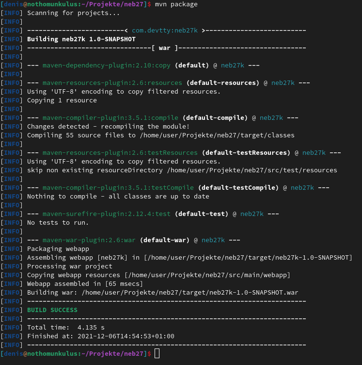

# Moderne Softwareentwicklung


## Einsendeaufgabe: Build Management

Denis Renning (BHT 914556)

### Aufgabenstellung

Bringen sie das Buildmanagement für ihr eigenes Projekt zum laufen.

Für diese Aufgabe habe ich mir wieder das aus der CCD-Aufgabe bekannte NEB27 Projekt rausgenommen, dessen Build-Management eigentlich mittels Apache Maven konfiguriert ist.
Für die BUI-Aufgabe nahm ich mir vor Alternativen per ANT und Gradle bereit zustellen (zumindest für den rudimentären clean/compile/package-Zyklus).

Die gesamten Arbeiten lassen sich im compare zwischen der CCD-und-BUI-Aufgabe sehen ([hier](https://github.com/devtty/neb27/compare/CCDrefactor...BUImanagement)). Für die Aufgabenstellung interessant sind dabei das

ANT-Build-Skript ([build.xml](https://github.com/devtty/neb27/blob/a96311dba8334373e84c82cfaa7e2bb412c48e1e/build.xml)) und die gradle-Konfiguration([build.gradle](https://github.com/devtty/neb27/blob/a96311dba8334373e84c82cfaa7e2bb412c48e1e/build.gradle)), welche im Grunde nur die Abhängigkeiten aus dem MavenCentral herunterladen, das gesamte Projekt kompilieren und dann das WebArchiv zusammenstellen.

Ausgehend vom Basisverzeichnis führen dann folgende Aufrufe zum Ergebnis

|Befehl                 |Ergebnis|
|-----------------------+--------|
| ```mvn clean```       | löscht ./target |
| ```mvn package```     | baut und erzeugt target/neb27k-1.0-SNAPSHOT.war |
| ```ant clean```       | löscht target/classes/ |
| ```ant```             | baut und erzeugt target/neb27byant.war |
| ```./gradlew clean``` | löscht ./build/ |
| ```./gradlew war```   | baut und erzeugt build/generated/libs/neb27-1.0-SNAPSHOT.war |

Zum Abschluss noch 3 Screenshot von den jeweiligen Builds

#### Maven



#### ANT


#### Gradle


