# Moderne Softwareentwicklung


## Einsendeaufgabe: Continous Integration

Denis Renning (BHT 914556)

### Aufgabenstellung

Bringen sie ein CI System wie Jenkins mit etwas Logik beweisbar zum laufen.

### Und wieder NEB27

Für diese Aufgabe habe ich mir wieder das bereits aus den vorherigen bekannte NEB27 Projekt herausgenommen, dessen CI Builds ursprünglich mittels Travis-CI erledigt wurden. Die entsprechende Konfiguration findet man [hier](https://github.com/devtty/neb27/blob/master/.travis.yml). Zusammengefasst überwachte TravisCI das Repository auf Änderungen und baute mittels Maven und Java8 das Webprojekt, im Anschluss wurden noch die Fahrpläne vom Berliner Verkehrsverbund heruntergeladen und im zu deployenden Paket entpackt. Danach wurde das Ganze in einer OpenShift-Instanz bereitgestellt. Leider ist das bereits Jahre her und seit dem führte Github die Workflows ein und die Unterstützung für TravisCI änderte sich auch ein wenig (bspw. war es mir im Rahmen dieser Aufgabe nicht mehr möglich einen kostenlosen Zugriff auf TravisCI zu ekommen). Als Alternative nun die Beschreibung für die Erzeugung des WebArchives mit Hilfe eine lokalen Jenkins-Installation.

### Jenkins

Den Jenkins-Server habe ich frisch als heruntergeladen (generic-war) und mittels 'java -jar jenkins' gestartet und installiert. Nachdem der Server startete mussten erst einmal in den Einstellungen (zu den Hilfsprogrammen) das JDK und die Maven-Installation eingestellt werden. Sowohl JDK als auch Maven waren bereits vorhanden.

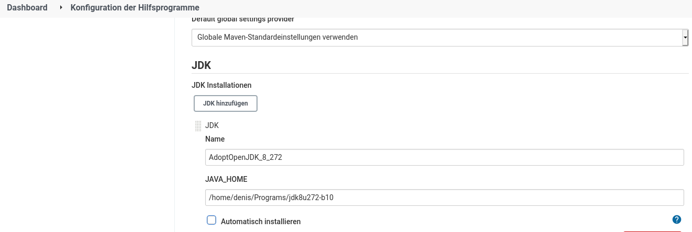
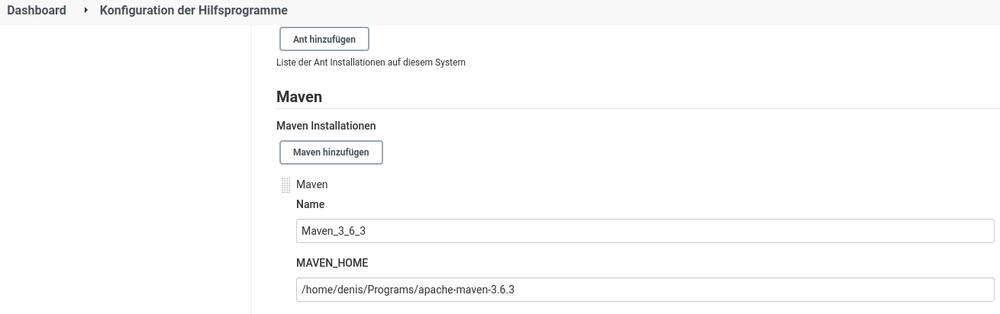

Danach musste das Projekt (als Freestyle-Projekt) erstellt werden.
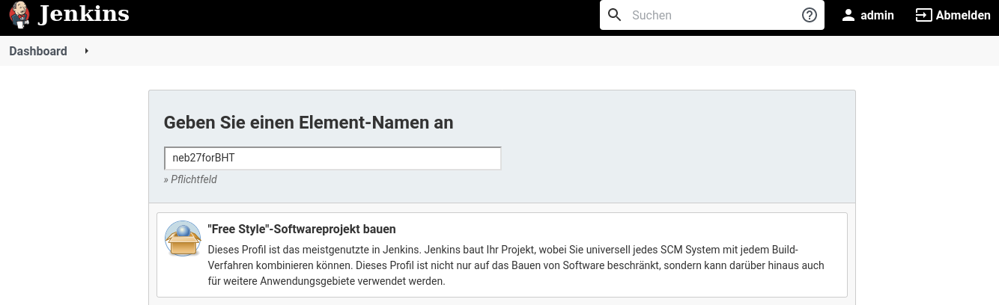

In den Allgemeinen Einstellungen wurden Name und Beschreibung vergeben.

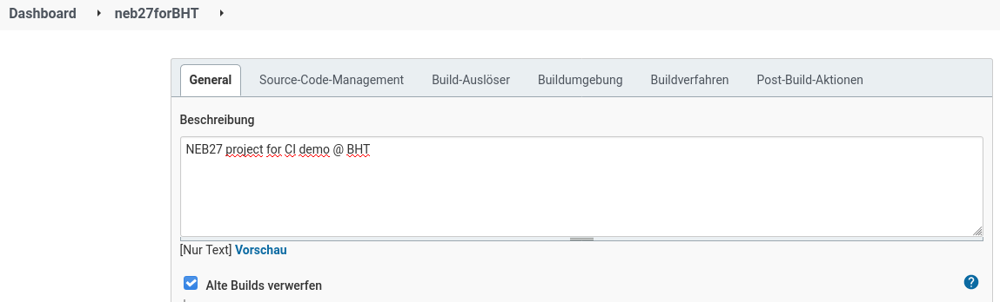

Dann wurde der Pfad zum git-Repostory eingestellt. Credentials müssen nicht angegeben werden, da auch ein anonymes auschecken des Projektes möglich ist.
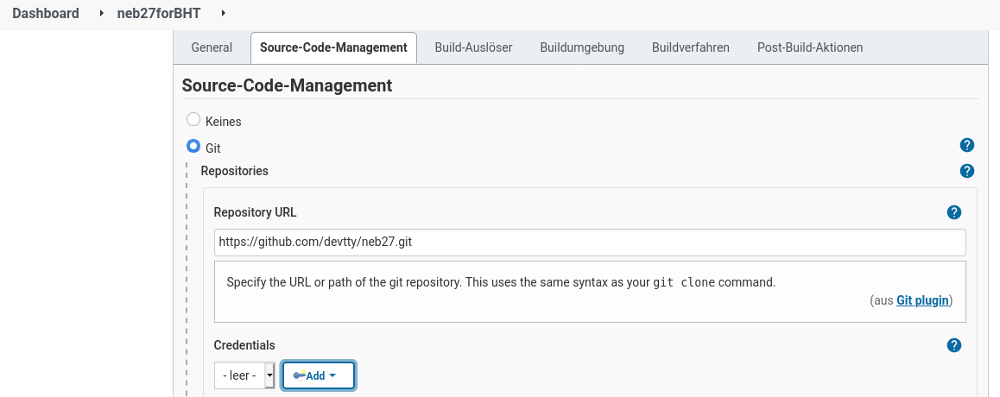

Empfehlenswert (zumindest bei kleineren Projekten) ist es immer mit einem sauberen Arbeitsplatz zu beginnen und die Projektquellen komplett neu herunterzuladen.  
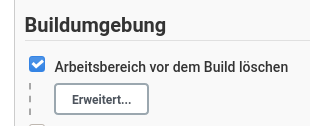

Die zeitliche Abfrage der Quellen emuliert in etwa das Verhalten der alten TravisCI-Builds bei etwaigen Änderungen am Quellcode automatisch einen Build anzustoßen.
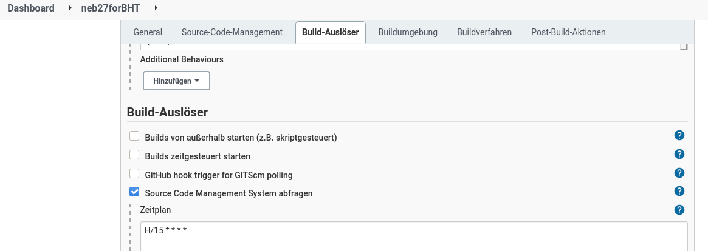

Als Maven-Ziel wird dann die Anwendung zusammengebaut
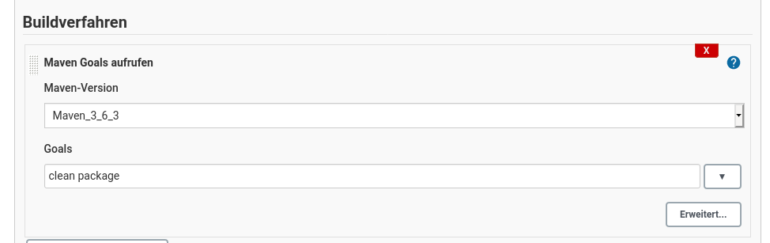

und das entstehende WAR-Paket für später (und zum Download) aufgehoben
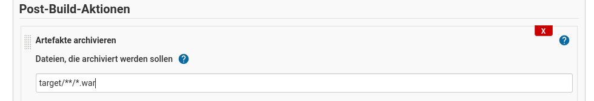

Nach Abspeichern der Konfiguration und einem Klick auf den "Jetzt bauen"-Knopf ist kurze Zeit später das Projekt fertig für den Download.
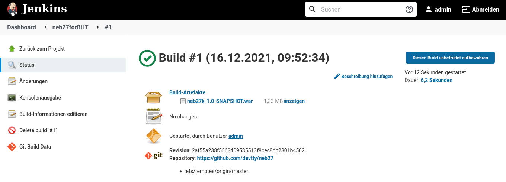

Und die Konsolenausgabe ist bekannt aus der vorherigen Aufgabe.
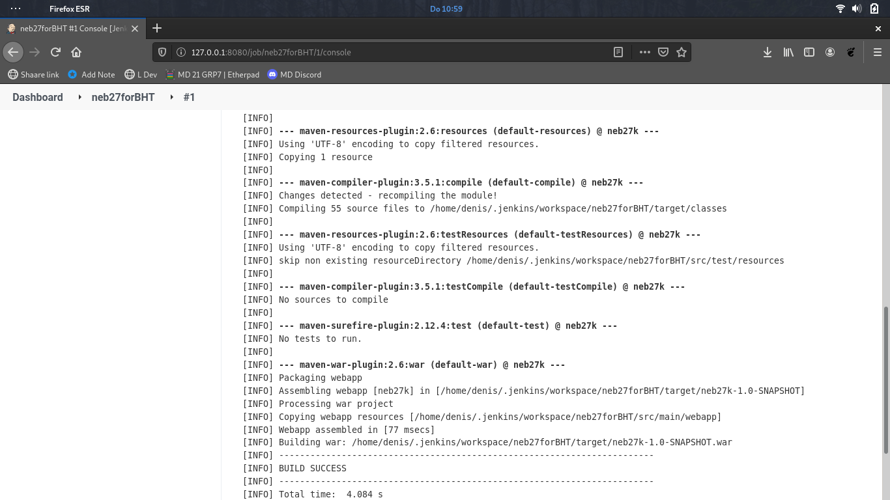

### GitHub Workflows

Um Gleiches innerhalb von GitHub selbst zu erreichen, erstellt man im Projekt-Verzeichnis den Ordner '.github' und darin einen Ordner 'workflows'. Im workflows-Ordner können dann entsprechende Buildkonfigurationen hinterlegt werden.

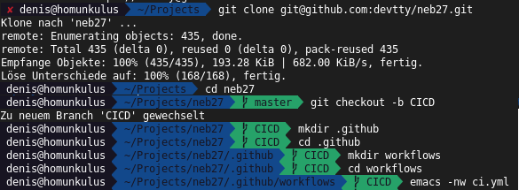

Im Fall der NEB-Anwendung hinterlegen wir folgende Konfiguration mit
 - dem Namen _ci_
 - die auf Push und pullrequest im Sourcecode reagieren soll
 - Alles soll unter JDK8 und Maven laufen (Setup JDK8)
 - (caching aus Gewohnheit) (Cache Maven Packages)
 - es wird mit Maven das Paket sauber gebaut (Build with Maven)
 - und am Ende möchten wir das WAR für die Nachwelt aufheben (upload WAR)

(https://github.com/devtty/neb27/blob/CICD/.github/workflows/ci.yml)

``` yaml
name: ci

on: [push, pull_request]

jobs:
  build:
    runs-on: ubuntu-latest

    steps:
      - uses: actions/checkout@v2
      - name: Set up JDK 8
        uses: actions/setup-java@v2
        with:
          java-version: '8'
          distribution: 'adopt'
      - name: Cache Maven packages
        uses: actions/cache@v2
        with:
          path: ~/.m2
          key: ${{ runner.os }}-m2-${{ hashFiles('**/pom.xml') }}
          restore-keys: ${{ runner.os }}-m2
      - name: Build with Maven
        run: mvn -B clean package --file pom.xml
      - name: upload WAR
        uses: actions/upload-artifact@v2
        with:
          name: neb27.war
          path: target/*.war
```

Am Ende kann im fertiggestellten Buildprozess

https://github.com/devtty/neb27/actions/runs/1586946128

nach jeder (erfolgreichen) Änderung des Quellcodes das WAR-Paket, wie im Jenkins-Build, heruntergeladen werden. 

und mit Screenshot
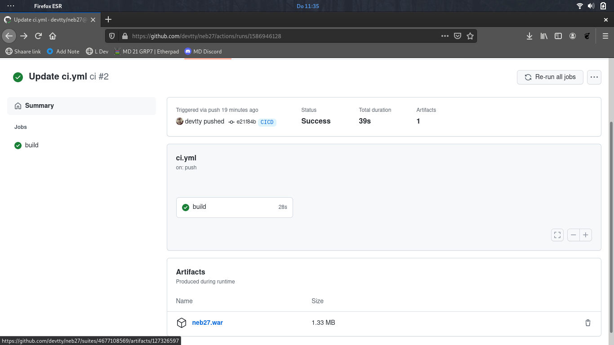