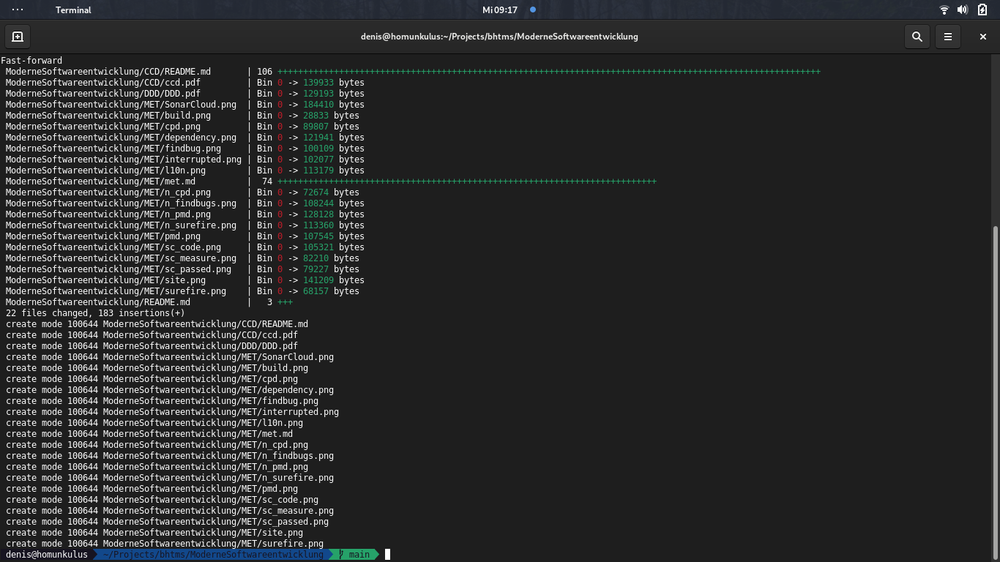
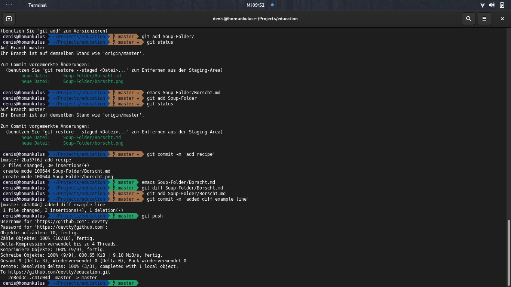
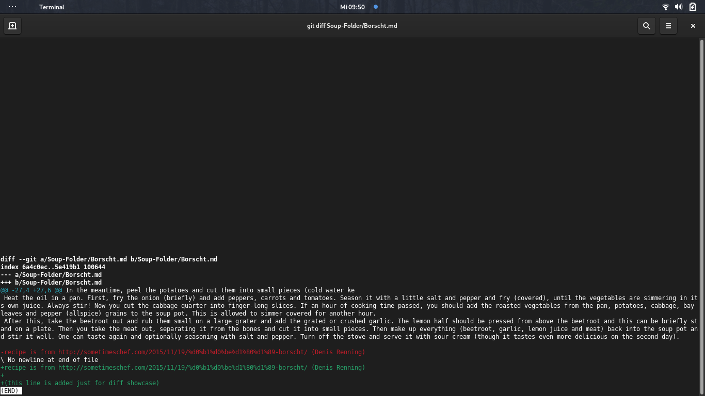

# Moderne Softwareentwicklung

## Einsendeaufgabe: Distributed Version Control Systems

Denis Renning (BHT 914556)

### Aufgabenstellung

Zur Beantwortung der Aufgabe empfehle ich das unter https://github.com/devtty/bhtms erreichbare Repository, da es sich hier um das Repository speziell zu Ihrem Modul handelt. Jedes andere Repository unter meinem github-Account wäre sicherlich ebenfalls geeignet.

#### Screenshots für _push, pull, add, commit, diff, status, rm/mv, etc._

git pull (ist leider nicht mehr auf dem Screenshot drauf, war ein wenig viel)

git status add commit und push für den Suppen-Ordner

git diff mal zwischendurch das Ergebnis hier

gibt es natürlich auch online unter https://github.com/devtty/education/commit/c41c04de0efe91192b9ef91321b49ec4067308c2

Den Pull Request haben Sie finden Sie unter

https://github.com/edlich/education/pull/319