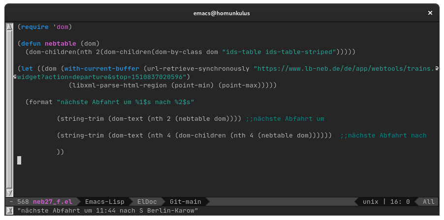
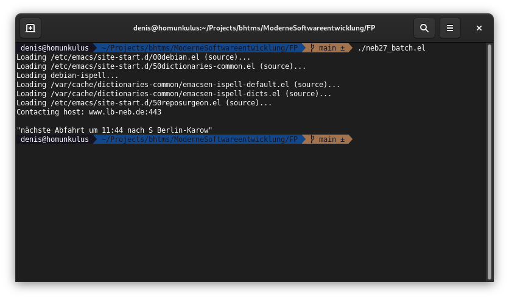

I# Moderne Softwareentwicklung


## Einsendeaufgabe: FP

Denis Renning (BHT 914556)

### Aufgabenstellung

1. Lesen Sie: Ben Mosley, Peter Marks "Out of the tar pit"
2. Lesen Sie: [http://www.defmacro.org/ramblings/lisp.html](http://www.defmacro.org/ramblings/lisp.html)

Schreiben sie mir zu beiden Artikeln ca. 2 Absätze!

Was halten sie davon? Was gefällt ihnen? Was ist noch wichtig? Was fällt Ihnen dazu ein? etc.


### Out of the tar pit

Die im Abschnitt beschriebenen Sichtweisen (imperative vs. functional, state vs. nonstate) finde ich durchaus spannend und diskutabel. In jedem Fall ist es von Vorteil für einen "pragmatischen" Entwickler beide Ansätze zu kennen. Vielleicht ist es bei den vorhergehenden Aufgaben bereits aufgefallen, dass ich mich beruflich größtenteils im JavaEE (OOP)-Umfeld aufhalte aber auch eine kleine Schwäche für Emacs inklusive dem damit verbundenen Lisp habe. Sehr begrüßt habe ich daher die Einführung von Lambda-Expressions/Streams in Java 8, bieten diese doch wesentliche Erleichterungen (und Ausdrücksstärke) für viele Probleme. Umgekehrt sind mir in einigen (Emacs-)Lisp-Programmen auch schon Konstrukte untergekommen, die Variablen speichern und "States" auswerten. Für die Praxis ("Keep it simple, stupid") sollte man beides kennen (und üben).  
Sehr interessant fand ich dabei die Ausführungen im Abschnitt "State and Modularity". Wie nebenbei fällt der Hinweis dass wir klare Trennungen verschiedener Bereiche bevorzugen.

>A further problem with the modularity argument is that some examples seem to be better addressed within the supporting infrastructure / language, rather than within the system itself (we prefer to advocate a clear separation between such administrative/diagnostic information and the core logic of the system).


Warum ist dies so? Kann man da auch irgendwie anders herangehen? In einem parallelen Kurs zu einem anderen Thema (UX) stieß ich auf einen lesenswerten Artikel ([1](https://docs.microsoft.com/de-de/archive/msdn-magazine/2016/february/cutting-edge-architecture-spinoffs-of-uxdd)) von Dino Esposito in dem es zwar nicht um funktionale Programmierung aber ähnliche Ursachen geht.

> Generationen von Softwarearchitekten (nun Manager) sind mit der Vorstellung aufgewachsen, dass alles, was zählt, ein solides Datenbankfundament ist.

Die Daten im "solides Datenbankfundament" eines relationalen Datenbanksystems sind die Definition für einen State, zeitlich gültig bis zum nächsten Commit.
Vorschlag: Emacs (mit Basiskurs Lisp) als Standard-IDE in der Lehre, das bringt Lernende evt. in näheren Kontakt mit funktionaler Programmierung, und der Religion ist auch noch gehuldigt :smile: 

### ramblings

Verdammt, jetzt hab ich mit dem letzten Satz des vorherigen Abschnitts schon vorgegriffen. Kult, Religion, egal! Kennt man heute eigentlich noch newsgroups? news:alt.religion.emacs. Auch wenn schon etwas älter, ein absolut cooler Artikel und für mich total nachvollziehbar. Mein erstes Studium (Diplom Medieninformatik an der FHTW) schloss ich 2003 ab und bin immer noch dankbar dass zwei der Professoren mir eine kleine Einführung in Emacs, und damit auch an elisp, gaben. Apache ANT war relativ neu und an Lambdas in Java war bei weitem noch nicht zu denken. Das Erstellen schneller Templates mittels Emacs jedoch schnell erlernt. Über die Jahre erweiterten sich die Kenntnisse im Emacs-Umfeld und damit auch in elisp, dass allein zur Konfiguration bereits notwendig ist. Abgesehen von der funktionalen Programmierung lohnt sich auch ein Abstecher in andere emacs-nahe Felder, wie orgmode (Projekt-/Knowledgemanagement) oder orgbabel (literate programming). Letzteres auch gut in Verbindung mit der funktionalen Programmierung.

###

Für die Programmieraufgabe gibt es ein kleines Skript, wie gehabt (und zum letzten Mal) mit NEB27-Bezug. Nach Aufruf wird von der NEB-Seite die nächste Abfahrt vom Bahnhof geparst und danach wiedergegeben.


```lisp
(require 'dom)

(defun nebtable (dom)
  (dom-children(nth 2(dom-children(dom-by-class dom "ids-table ids-table-striped")))))

(let ((dom (with-current-buffer (url-retrieve-synchronously "https://www.lb-neb.de/de/app/webtools/trains.widget?action=departure&stop=1510837020596")
	     (libxml-parse-html-region (point-min) (point-max)))))
  
  (format "nächste Abfahrt um %1$s nach %2$s"
	  (string-trim (dom-text (nth 2 (nebtable dom)))) ;;nächste Abfahrt um
	  (string-trim (dom-text (nth 4 (dom-children (nth 4 (nebtable dom))))))  ;;nächste Abfahrt nach
	  ))
```

Die Auswertung in emacs gibt das Ergebnis im mini-buffer (unterste Zeile) wieder. 



Im Repository [https://github.com/devtty/bhtms/tree/main/ModerneSoftwareentwicklung/FP] liegt noch eine Version die das Ganze als Shell-Skript aufruft. Die Ausgabe in der Shell sieht folgend aus:

