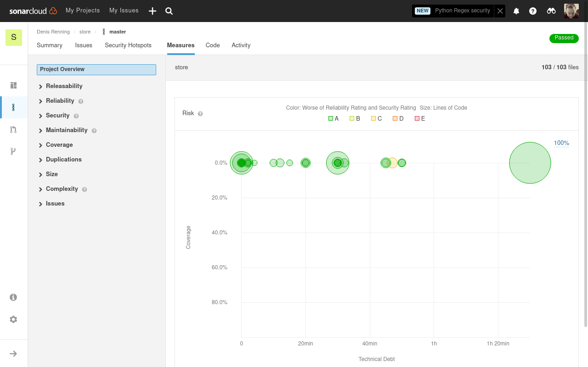

# Moderne Softwareentwicklung

## Einsendeaufgabe: Metriken

Denis Renning (BHT 914556)

Für diese Einsendeaufgabe hole ich mal ein älteres Migrationsprojekt raus, welches ich vor einigen Jahren mal vergaß weiter nachzuverfolgen (aber den Vorteil hat bereits aufbereitete Metriken in der Dokumentation zu enthalten). Die Quellen finden Sie unter https://github.com/devtty/store . Es handelt sich um ein JavaEE-Projekt (JPA/JSF/JDK8) bei dem der Build-Prozess per Apache Maven anläuft. Ebenso kann eine Maven-typische Dokumentation erzeugt werden. Der Build-Prozess ist so definiert dass die Dokumentation lokal erzeugt werden kann und ggf. auf die Seite http://store.devtty.de/ hochgeladen wird. Dort finden Sie im Bereich Project Reports die Auswertungen zu.

#### CPD

CPD ist der Copy/Paste-Detector und Teil der PMD-Auswertungen

#### PMD
PMD ist ein statisches Quellcode-Analyse Tool

#### SureFire
SureFire bietet die Auswertung von Tests 

#### FindBugs

FindBugs findet allgemein Fehler und CodeSmells

#### l10n Status

Eigentlich keine Software-Metrik, hier wird nur der Status der sprachlichen Übersetzungen in der Anwendung gemessen.

#### SonarCloud
Des Weiteren ist per Webhook auch Sonarqube per Sonarcloud eingebunden. Die entsprechenden Ergebnisse finden Sie unter 

https://sonarcloud.io/summary/overall?id=devtty_store

### Ein neuer Durchlauf

Die bisherigen Screenshots repräsentieren die Dokumentation vom Stand 14.06.2016 (maven) und 21.09.2018 (sonar) - also Zeit für eine Auffrischungskur. Ich hab im Anschluss an die bisherigen Screenshots den Code noch einmal ausgecheckt und die maven-plugins für die Metriken noch einmal aktualisiert. Des Weiteren habe ich noch das OWasp-Dependency-Check plugin aktiviert (keine Metrik an sich aber dennoch eines der wichtigsten Must-haves bei der Code-Analyse) und die Sonar-Integration ist dabei leider weggefallen, da der Aufwand für momentan etwas zu hoch ist (Java8-Projekt beisst sich mit Java11-Sonar, Tests laufen hier nicht, usw.)

Wie man anhand der folgenden Bildern sieht, wurde seit 2016 doch ein wenig am Code gearbeitet. Zumindest wurden die Code-Duplikationen entfernt und 4 Tests wurden hinzugefügt (auch wenn diese derzeit fehlschlagen). Anhand des OWASP dependency-checks sieht man dass auch Bereich der Sicherheit einiges getan werden muss.

