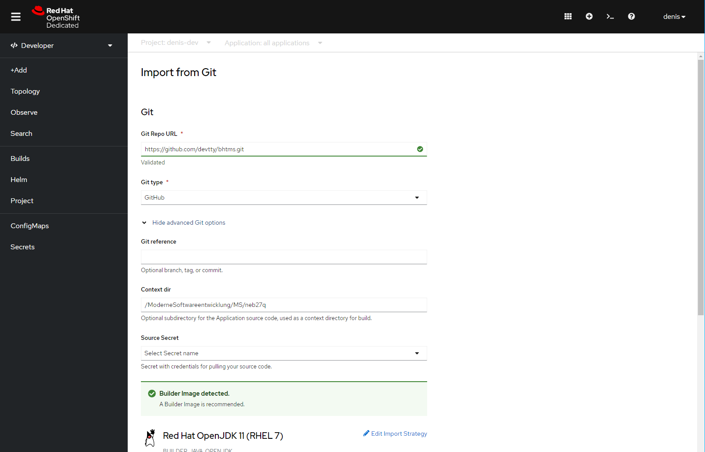
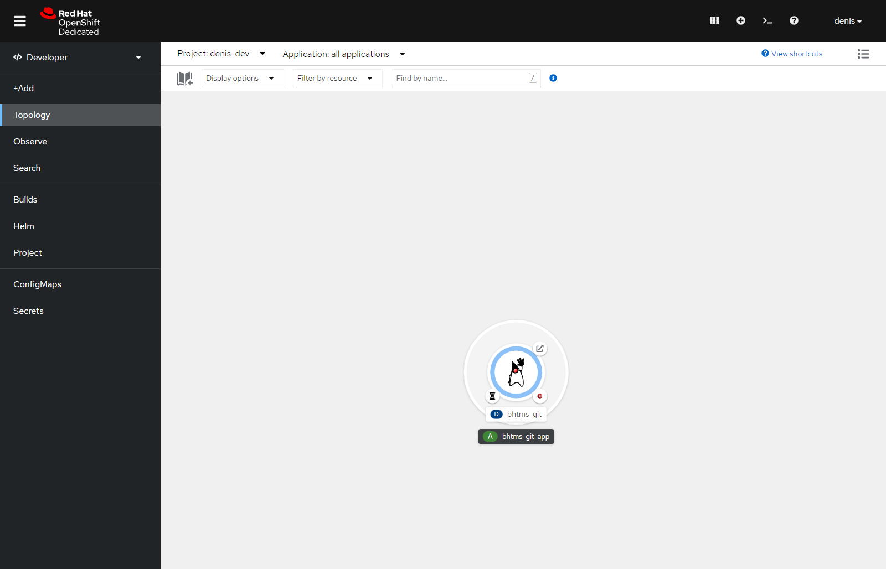
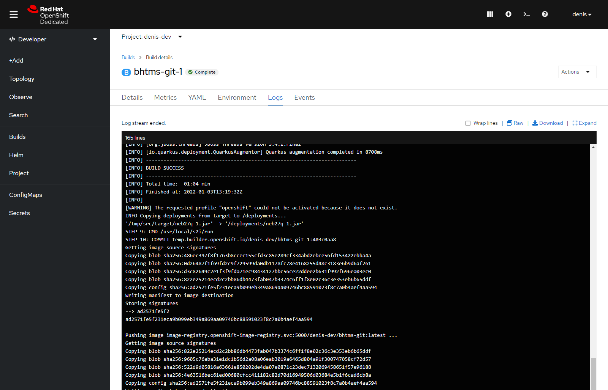
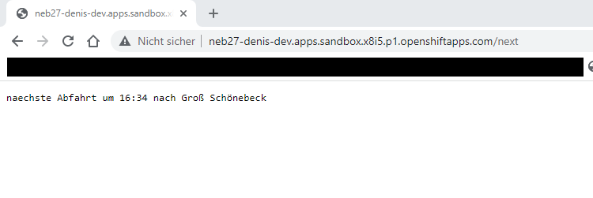

# Moderne Softwareentwicklung


## Einsendeaufgabe: AOP & MS

Denis Renning (BHT 914556)

### Aufgabenstellung

Entweder:
A) Bringen sie AspectJ zum Laufen! Denken sie sich selbst einen interessanten kleinen eigenen (!) AOP Anwendungsfall aus, den sie mit AspectJ ausprobieren und kurz beschreiben (incl. z.B. IDE Screenshot). (Dies sollte in weniger als 30 Minuten zu schaffen sein!)
Bonuspunkte gibt es wie immer für alles Mögliche was darüber hinausgeht.

oder

B) Spielen sie mit Microservices! (auch mit den API Tools wie swagger, kong, Dropwizard, etc.). Bauen sie selbst einen kleinen mit Nano-Funktionen ;-)
Gerne auch auf Docker Deployen und "irgendwie" kommunizieren lassen...

oder

C) Wenn sie AWS Affin sind, erstellen sie einen einfachen Lambda Code / Service der etwas einfaches tut.
Z.B. Datei aus S3 lesen und Wörter / Zeichen zählen und in zweite Datei schreiben...
Hier gibt es viele Web Beispiele (die aber bitte nicht 1:1 kopieren! ;-)


### Und (schon) wieder NEB27

Dieses Mal möchte ich dass aus den vorherigen Aufgaben bekannte Projekt nutzen um eine Lösung die irgendwo zwischen Aufgabenstellung B und C angesiedelt ist bereit zustellen. Bei dem Referenzprojekt (NEB27) handelte es sich bisher um eine (monolithische) JavaEE7-Webanwendung welche nun teilweise einen Rewrite a la Microservices erhält. (die Twitterfunktion lass ich aber unter den Tisch fallen :smile: ). Bei der Umsetzung habe ich mich für [Quarkus](https://quarkus.io) für die Anwendungen und [RedHat OpenShift](https://www.redhat.com/de/technologies/cloud-computing/openshift) als Plattform entschieden.

Als erstes wurde die Anwendung in zwei Teile (Services/Dienste) geteilt, jeder sehr einfach gehalten und mit eigener Zuständigkeit (Single Reponsibility).

 - [neb27q](https://github.com/devtty/bhtms/tree/main/ModerneSoftwareentwicklung/MS/neb27q) - Service der notwendige Daten bei der Bahn abfragt
 - [neb27t](https://github.com/devtty/bhtms/tree/main/ModerneSoftwareentwicklung/MS/neb27t) - Service der Daten an IoT-Endpunkt weitergibt

Im Aufbau entspricht jeder Teil in etwa dem Quarkus-Beispielprojekt (Maven-Archetyp) bei dem eine Klasse für die Funktionalität sorgt. Neben der Möglichkeit den Blueprint für den Microservice über Maven-Archetypes zu erzeugen besteht auch die Möglichkeit des Downloads über [https://code.quarkus.io/](https://code.quarkus.io/). Für neb27q bzw. neb27t werden noch die Erweiterungen "quarkus-resteasy" und "quarkus-openshift" benötigt um notwendige Kommunikation zwischen den Diensten zu gewährleisten. Des Weiteren benötigt neb27t die Erweiterung "quarkus-scheduler" da es sich um einen zeitbasierten Dienst handelt. Die Erweiterungen können mittels

``` console
foo@bar:~$ ./mvnw quarkus:add-extension -Dextensions="quarkus-resteasy, ...
```

dem jeweiligen Projekt hinzugefügt werden. 


<details>
<summary>Hier klicken: Für Details zur Funktionalität von neb27q - Daten-Service</summary>
<p>
Holt die Information für die nächste Abfahrt eines Zuges vom Bahnhof, formatiert diese und liefert den Plain-Text ggf. aus.


```java
@Path("/next")
public class AbWandlitzResource {

    @GET
    @Produces(MediaType.TEXT_PLAIN)
    public String hello() {

	String ret = "";
	try{
	    Document doc = Jsoup.connect("https://www.lb-neb.de/de/app/webtools/trains.widget?action=departure&stop=1510837020596").get();
	    Element firTime = doc.select(".ids-table > tbody:nth-child(2) > tr:nth-child(1) > td:nth-child(2)").first();
	    Element firDire = doc.select(".ids-table > tbody:nth-child(2) > tr:nth-child(1) > td:nth-child(3) > strong:nth-child(3)").first();
	    Element secTime = doc.select(".ids-table > tbody:nth-child(2) > tr:nth-child(2) > td:nth-child(2)").first();
	    ret = "naechste Abfahrt um " + firTime.text() + " nach " + firDire.text();
	}catch(Exception e){
	    ret = "error" + e.getMessage();
	}

        return ret;
    }
}
```
</p>
</details>

<details>
<summary> Hier klicken: Für Details zur Funktionalität von neb27t - Timer-Service</summary>
<p>
Da sich der Datendienst (neb27q) irgendwo in "der Cloud" bzw. im OpenShift befindet und dessen Adresse evt. noch nicht bekannt ist, muss beim Start des Dienstes ('onStart(@Observes StartupEvent ev)') die entsprechende Verbindung erst noch gesucht werden (Discovery). (Bei einem kleinen Projekt wie diesem hätte man den Host natürlich auch aus der Konsole ablesen und statisch verdrahten können, dieses entspricht allerdings nicht dem Sinn :smile: des Microservice-Ansatzes  ). Der Dienst kann jedoch selbst mit OpenShift interagieren und die entsprechenden Routen abfragen ('openshiftClient.routes()') und der host wird in der Variable 'host' zwischengespeichert.

In der 'push'-Methode, die alle 5 Minuten ausgeführt wird, wird der Status der nächsten Zugabfahrt vom Datenservice (neb27q) abgefragt und an den Endpunkt eines IoT-Gerätes per REST-Schnittstelle weitergeleitet.


```java
@ApplicationScoped
public class LaMetricPushResource {

    private static final String LAMETRIC_DEV_CON = "https://developer.lametric.com";
    private static final String LAMETRIC_WIDGET_URI = "api/V1/dev/widget/update/com.lametric.20d9fabf0b232dc145b0b82d9deb8ea9/1 ";

    @Inject OpenShiftClient openshiftClient;

    String host = null;
    
    void onStart(@Observes StartupEvent ev){
	LabelSelector selector = new LabelSelectorBuilder().withMatchLabels(Map.ofEntries(entry("endpoint", "client"))).build();

	List<Route> routes = openshiftClient.routes().withLabelSelector(selector).list().getItems();

	Route route = routes.get(0);
        
        host = route.getSpec().getHost();

    }
    
    @Scheduled(every="300s")
    void push() {	
	
        try {
            URL url = new URL("http://" + host);
            Scanner s = new Scanner(url.openStream());
            String message = s.nextLine();
        } catch (MalformedURLException ex) {
            Logger.getLogger(LaMetricPushResource.class.getName()).log(Level.SEVERE, null, ex);
        } catch (IOException ex) {
            Logger.getLogger(LaMetricPushResource.class.getName()).log(Level.SEVERE, null, ex);
        }
        
	JsonObject message = Json.createObjectBuilder()
	    .add("frames", Json.createObjectBuilder()
		 .add("index", 0)
		 .add("text", messageText)
		 .add("icon", "i1347")
		 )
	    .build();

	Client restClient = new ResteasyClientBuilder().build();      
        
        WebTarget target = restClient.target(LAMETRIC_DEV_CON).path(LAMETRIC_WIDGET_URI);
        
        CacheControl cacheControl = new CacheControl();
        cacheControl.setNoCache(true);

        Response response = target.request().accept(MediaType.APPLICATION_JSON).cacheControl(cacheControl).header("X-Access-Token", accessToken).post(Entity.json(message));
    }
}
```
</p>
</details>

Während und nach der Implementation können per Maven verschiedene Ziele nützlich sein:

Kompilieren des Projektes und starten des Dienstes in einer Entwicklungsumgebung: 

``` console
foo@bar:~$ ./mvnw compile quarkus:dev
```

Zusammenbau des Dienstes als Container-Image (je nach Konfiguration als Docker oder S2I-Image)
``` console
foo@bar:~$ ./mvnw clean package -Dquarkus.container-image.build
```

Zusammenbau des Dienstes als ausführbares Uber-jar
``` console
foo@bar:~$ ./mvnw clean package -Dquarkus.package-type=uber-jar
```

Zusammenbau des Dienstes als native Executable (bei installierter GraalVM)
``` console
foo@bar:~$ ./mvnw clean package -Pnative
```

Sowohl die Container-Images als auch das Uber-Jar und das Executable können in einer lokalen Kubernetes oder über die Webkonsole in OpenShift bereitgestellt werden.

Des Weiteren kann aber auch direkt in einen konfigurierten Container deployed werden:

``` console
foo@bar:~$ ./mvnw clean package -Dquarkus.kubernetes.deploy=true
```

Für den ersten Dienst folgt beispielhaft ein manuelles Bereitstellen in der OpenShift-Webkonsole als git-Repository. 



Das Repository wurde erfolgreich als Microservice erkannt und OpenShift beginnt den Service bereitzustellen.



OpenShift hat mittels Maven das Projekt gebaut und s2i-Image erstellt und in seine registry gepusht. Danach wird der Dienst bereitgestellt.



Kurzer Test ob der Dienst erreichbar ist: 




