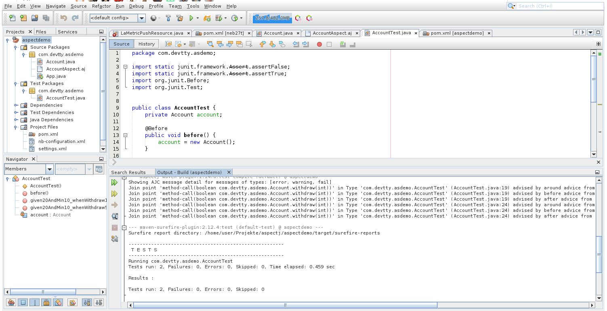

# AspectJ Demo


Original

 [https://www.baeldung.com/aspectj](https://www.baeldung.com/aspectj)

## Anpassungen:

- kompiliert mit JDK 1.8 (siehe nb-configuration.xml)
- in pom.xml Version von AspectJ von 1.8.9 auf 1.9.7 erhöht
- in pom.xml Version von JUnit von 3 auf 4.13
- in pom.xml Version von aspectj-maven-plugin auf 1.14.0 erhöht

## Test:

``` console
foo@bar:~$ ./mvn clean install
```



Log-Output im Fenster rechts/unten, die oberen Zeilen zeigen das Weaving im compile-Schritt
und die Tests darunter den erfolgreichen Test.


